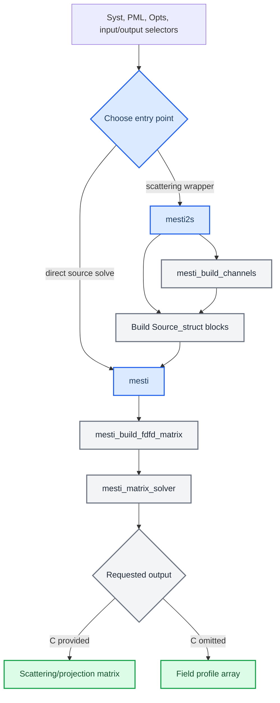

# MESTI Python Port

_Reusable Python core for the MESTI Julia-to-Python port under `Simulation/python`._

> [!WARNING]
> This project is not finished and may contain many bugs.

This project is the Python version of the MESTI.jl project: https://github.com/complexphoton/MESTI.jl/tree/main.

---

## Overview

This package is a native Python port of the project-local Julia MESTI code in
[`Simulation/julia/MESTI.jl-0.5.1`](../../julia/MESTI.jl-0.5.1). The current
implementation began with the 2D TM/scalar workflow needed by
[`simu_test_2D_TM.py`](../simu_test_2D_TM.py): building channels, assembling a
finite-difference frequency-domain operator, solving sparse linear systems, and
returning either scattering matrices or field profiles.
The post-2D expansion now also includes Julia-fixture-verified 3D vectorial FDFD assembly and high-level direct `mesti` solves for diagonal and off-diagonal tensor permittivity, 3D `mesti2s` channel/scattering paths for diagonal tensors and fixture-backed off-diagonal tensors, fixture-backed 2D TM/TE plus small 3D subpixel smoothing for rectangular `Cuboid` geometry, compact raw-MUMPS helper demo translations backed by the Python compatibility facade, and importable numerical helpers for selected example scripts.

The public names intentionally mirror Julia names where practical. This keeps
the port easy to compare with the original implementation, but Python
conventions are used where they matter most: channel and grid indices are
zero-based, arrays are NumPy/SciPy objects, and unsupported Julia paths fail
explicitly with `NotImplementedError` or a validation error. Curved
GeometryPrimitives shapes used by the Julia examples, currently `Ball`, are
represented as compatibility stubs so unsupported subpixel paths fail with a
specific message.

The v6 production-solver slice is complete; it added explicit `mumpspy`
single-precision MUMPS support and production-scale memory diagnostics. Its
final scope, deferred items, and maintenance recommendations live in
[`mesti_python_port_plan_v6.md`](../../../.codex/mesti_python_port_plan_v6.md).
The older v1/v2/v3/v4/v5 plans remain historical context only.

## Status

| Area | Current state |
| --- | --- |
| Phase | V6 completed the first production-solver/lower-memory slice; future production work should build on the recorded v6 diagnostics rather than treating `Ws300 Ls37.5` as solved |
| Port scope | Verified 2D TM/scalar behavior is complete for the current validation target, including high-level `mesti2s` symmetrized-K channel padding for channel-index scattering; the 3D expansion covers diagonal and off-diagonal vectorial FDFD assembly, direct 3D `mesti` field/projection solves, diagonal 3D `mesti2s` s/p channel scattering plus homogeneous field-profile extension, off-diagonal 3D `mesti2s` two-sided scattering and one-sided low reflection, 2D TM/TE subpixel smoothing, and small 3D tensor subpixel smoothing for rectangular `Cuboid` objects including edge/corner cuts |
| Validation | Unit tests cover dataclasses, PML/boundary helpers, channels, 2D and 3D FDFD assembly, 2D and direct-3D `mesti`, 2D and 3D `mesti2s` including 2D symmetrized-K wrapper parity and high-level 2D APF-default parity, explicit low-level SciPy FG parity, explicit `mumpspy` single-precision parity, 2D TM/TE and small 3D Cuboid subpixel smoothing, reduced packaged Gaussian-beam reflection, open-channel-through-disorder, phase-conjugation focusing, metalens angular-spectrum, 3D open-channel examples, raw-MUMPS basic solve and Schur-complement demo parity, CLI output, Julia parity fixtures, a cropped-real double-MUMPS fixture, cropped-real single-precision diagnostics, and finite-PML 2D/3D unitarity guards |
| Solvers | SciPy/SuperLU is the fallback and supports factorize-and-solve plus explicit FG projected solves; optional MUMPS bindings are supported through `mumpspy` or `python-mumps`, with `mumpspy` preferred in auto/MUMPS mode and high-level 2D TM projected solves defaulting to APF when `mumpspy` is selected/available; explicit `Opts.use_single_precision_MUMPS=True` is supported only for `mumpspy`; Julia's raw MUMPS/MPI helper layer is intentionally delegated to Python bindings |
| Real-data notes | The smaller `Ws30 Ls7.5` real case runs with WSL base Python and `mumpspy`; tight Python-vs-Julia real-data parity requires Julia double MUMPS, while explicit `mumpspy` single precision showed about `2e-4` relative drift on the centered cropped-real diagnostic |
| Remaining risk | Production-size `Ws300 Ls37.5` remains blocked: double `mumpspy` APF reached about 40 GB RSS before completion, and explicit single-precision `mumpspy` APF was stopped at 36,488,896 KB RSS before writing transmission output |

## Package map

| File | Purpose |
| --- | --- |
| [`__init__.py`](__init__.py) | Public package exports matching the ported MESTI API |
| [`types.py`](types.py) | Dataclasses for `Syst`, `PML`, `Opts`, `Info`, channel selectors, channel metadata, and solver matrices |
| [`solver.py`](solver.py) | Sparse direct solver wrapper for linear solves, projected solves, and optional `D` subtraction |
| [`../docs/cudss_nvmath.md`](../docs/cudss_nvmath.md) | WSL `nvmath-python`/cuDSS environment commands and probe guidance for the explicit cuDSS backend |
| [`boundary.py`](boundary.py) | Boundary-condition normalization, PML parameter defaults, derivative matrices, and averaging matrices |
| [`channels.py`](channels.py) | 2D TM and diagonal-3D transverse modes, longitudinal channel metadata, and one/two-sided channel setup |
| [`examples.py`](examples.py) | Fixture-friendly translations of selected packaged Julia examples, compact raw-MUMPS demos, ASP/distribution helpers, and explicit unsupported stubs for random Ball-disorder builders |
| [`fdfd_matrix.py`](fdfd_matrix.py) | 2D TM/scalar and 3D vectorial FDFD matrix assembly with Julia-compatible column-major vectorization |
| [`mesti.py`](mesti.py) | High-level direct solve wrapper for 2D TM and 3D vectorial field profiles and projected solves |
| [`mesti2s.py`](mesti2s.py) | 2D TM and 3D scattering wrapper for channel and wavefront inputs |
| [`mumps.py`](mumps.py) | V7 compatibility facade for Julia raw-MUMPS helper names, with SciPy-backed small algebra helpers and explicit unsupported raw C/MPI invocation |
| [`subpixel.py`](subpixel.py) | 2D TM/TE and small 3D subpixel smoothing for rectangular `Cuboid` domains and objects, plus explicit unsupported `Ball` compatibility stubs |

## Call flow



## Quick start

Run examples and tests from `Simulation/python` so `import mesti` resolves to
this local package.

```powershell
cd Simulation\python
conda run -n simu_scattering_light python -m unittest discover -s tests
```

Minimal low-to-high transmission example:

```python
import numpy as np

from mesti import Opts, PML, Syst, channel_type, mesti2s

syst = Syst(
    epsilon_xx=np.ones((3, 2), dtype=np.complex128),
    epsilon_low=1.0,
    epsilon_high=1.0,
    wavelength=2 * np.pi,
    dx=1.0,
    yBC="periodic",
    zPML=[PML(4)],
)

t, channels, info = mesti2s(
    syst,
    channel_type(side="low"),
    channel_type(side="high"),
    Opts(solver="scipy", verbal=False),
)

print(t.shape)
print(channels.low.N_prop, channels.high.N_prop)
print(info.opts.solver)
```

Minimal field-profile example from a low-side wavefront:

```python
import numpy as np

from mesti import Opts, PML, Syst, wavefront, mesti2s

syst = Syst(
    epsilon_xx=np.ones((3, 2), dtype=np.complex128),
    epsilon_low=1.0,
    epsilon_high=1.0,
    wavelength=2 * np.pi,
    dx=1.0,
    yBC="periodic",
    zPML=[PML(4)],
)

v_low = np.ones((1, 1), dtype=np.complex128)
Ex, channels, info = mesti2s(
    syst,
    wavefront(v_low=v_low),
    Opts(solver="scipy", verbal=False),
)

print(Ex.shape)
print(info.opts.return_field_profile)
```

Reduced Gaussian-beam reflection example:

```python
import numpy as np

from mesti import reflection_matrix_gaussian_beams

epsilon_xx = np.ones((15, 11), dtype=np.complex128)
result = reflection_matrix_gaussian_beams(
    epsilon_xx=epsilon_xx,
    wavelength=1.0,
    dx=0.25,
    pml_npixels=2,
    y_focus=[1.4, 2.0, 2.6],
    z_focus=1.5,
    source_plane_index=2,
    solver="scipy",
)

print(result.reflection.shape)
print(result.field_profiles.shape)
```

Reduced open-channel-through-disorder example:

```powershell
cd Simulation\python
python examples\open_channel_through_disorder.py
```

Reduced focusing-inside-disorder phase-conjugation example:

```powershell
cd Simulation\python
python examples\focusing_inside_disorder_with_phase_conjugation.py
```

Reduced metalens angular-spectrum propagation example:

```powershell
cd Simulation\python
python examples\metalens_focusing_via_angular_spectrum_propagation.py
```

Reduced 3D open-channel-through-disorder example:

```powershell
cd Simulation\python
python examples\open_channel_through_disorder_3d.py
```

Compact raw-MUMPS helper demos:

```powershell
cd Simulation\python
python examples\basic_mumps_solve.py
python examples\mumps_schur_complement.py
```

Hybrid MPI compatibility decision:

```powershell
cd Simulation\python
python examples\hybrid_mpi.py
```

This script prints the recorded unsupported decision for Julia
`MPI/hybrid_mpi.jl` and exits nonzero. It does not launch MPI ranks.

Importable example helpers:

```python
import numpy as np

from mesti import asp, plot_and_compare_distribution

field = np.ones(8, dtype=np.complex128)
kx = np.linspace(0.8, 1.2, 5)
propagated = asp(field, 1.5, kx, ny_tot=8)
distribution = plot_and_compare_distribution([0.05, 0.3, 0.7, 1.0])

print(propagated.shape)
print(distribution.pdf.shape)
```

## Main API

### Data containers

| Name | Role |
| --- | --- |
| `Syst` | Simulation system descriptor. For the current port, set `epsilon_xx`, `wavelength`, `dx`, transverse boundary data, and either `PML` or `zPML` depending on entry point |
| `PML` | Perfectly matched layer parameters. Most fields may be left as `None`; helper code fills Julia-compatible defaults |
| `Opts` | Solver and wrapper options such as `solver`, `nrhs`, `verbal`, `prefactor`, `exclude_PML_in_field_profiles`, `return_field_profile`, `nz_low`, and `nz_high` |
| `Info` | Timing, solver, PML, and bookkeeping data returned by solves |
| `Matrices` | Low-level solver container for `A`, `B`, optional `C`, and optional `D` |
| `Source_struct` | Sparse source/projection descriptor using zero-based `ind` or inclusive zero-based `pos` ranges |
| `Cuboid` | Axis-aligned 2D/3D geometry supported by the current subpixel smoothing slices |
| `Ball` | Curved GeometryPrimitives compatibility stub; construction is supported, but subpixel smoothing raises `NotImplementedError` |

### Channel selectors

| Name | Use |
| --- | --- |
| `channel_type(side="low" | "high" | "both", polarization="s" | "p" | "both")` | Select all propagating channels on one or both sides; `polarization` is used by 3D paths |
| `channel_index(ind_low=[...], ind_high=[...])` | Select zero-based 2D propagating channel submatrices |
| `channel_index(ind_low_s=[...], ind_low_p=[...], ind_high_s=[...], ind_high_p=[...])` | Select zero-based 3D s/p propagating channel submatrices |
| `wavefront(v_low=..., v_high=...)` | Supply 2D linear combinations of propagating channels |
| `wavefront(v_low_s=..., v_low_p=..., v_high_s=..., v_high_p=...)` | Supply 3D linear combinations of s/p propagating channels |

### Solver-facing functions

| Function | Returns |
| --- | --- |
| `mesti_matrix_solver(Matrices(A, B, C=None, D=None), opts)` | Dense complex result plus `Info` for a sparse direct solve |
| `mesti_build_fdfd_matrix(...)` | CSC FDFD operator, symmetry flag, and filled PML objects for 2D TM/scalar or 3D vectorial tensor assembly |
| `mesti_subpixel_smoothing(...)` | Fixture-backed 2D TM `epsilon_xx`, 2D TE inverse-epsilon `(yy, zz, yz)`, combined TM+TE, or small 3D tensor components for rectangular `Cuboid` geometry; curved `Ball` geometry raises an explicit unsupported error |
| `mesti(syst, B, C=None, D=None, opts=None)` | Field profile when `C` is omitted; projected matrix when `C` is provided |
| `mesti2s(syst, input, output=None, opts=None)` | Field profile when `output` is omitted; scattering/projection matrix when `output` is provided |

## Supported scope

| Feature | Supported behavior |
| --- | --- |
| Geometry | 2D TM/scalar systems with `epsilon_xx` as a 2D array; 2D subpixel smoothing can generate TM `epsilon_xx` and TE inverse-epsilon components from rectangular `Cuboid` domains and objects; the small 3D subpixel slice can generate tensor components for face-planar and edge/corner rectangular `Cuboid` cuts; `Ball` exists as an explicit unsupported curved-shape stub; 3D vectorial FDFD and direct `mesti` accept diagonal arrays plus optional `epsilon_xy`, `epsilon_xz`, `epsilon_yx`, `epsilon_yz`, `epsilon_zx`, and `epsilon_zy`; 3D `mesti2s` supports diagonal tensors and fixture-backed off-diagonal tensors |
| Vectorization | Julia-compatible column-major order, using `order="F"` where arrays are flattened or reshaped; 3D electric unknowns are stacked as `[Ex[:]; Ey[:]; Ez[:]]` |
| Boundaries | `PEC`, `PMC`, `PECPMC`, `PMCPEC`, `periodic`, numeric Bloch phase values, and direct-`mesti` `kx_B`/`ky_B`/`kz_B` convenience fields with Julia-compatible default `PEC` boundaries |
| PML | One or two `PML` layers for `mesti2s`; direction-specific or `direction="all"` PML layers for direct `mesti`, with `Syst.PML_type` selecting `UPML` or `SC-PML` |
| Channels | 2D TM and 3D one-sided and two-sided propagating-channel metadata, including numeric Bloch phases and nonzero transverse origins |
| Scattering | 2D low/high/both channel selection plus 3D s/p low/high/both selection, zero-based submatrix selection, wavefront input/output projections, diagonal one-sided reflection paths, off-diagonal two-sided tensor scattering and one-sided low reflection, and finite-PML lossless unitarity regression coverage |
| Field profiles | 2D original scattering region by default with optional homogeneous low/high side pixels through `Opts.nz_low` and `Opts.nz_high`; 3D diagonal `mesti2s` supports the same low/high homogeneous extension for verified Yee-grid shapes |
| Direct solves | Dense, sparse, `Source_struct`, and `C="transpose(B)"` source/projection paths through `mesti`; direct solves apply `Opts.prefactor` before optional `D` subtraction and can trim returned PML pixels from field profiles |
| MAT workflow | `simu_test_2D_TM.py` reads `.mat` or `.npz` input, writes `py_`-prefixed MATLAB output files, and exposes `--solver`, `--nrhs`, `--method`, `--single-precision-mumps`, and `--skip-field` |

## Conventions

- Indices in Python APIs are zero-based, including `Source_struct.ind`,
  `Source_struct.pos`, `channel_index.ind_low`, and `channel_index.ind_high`.
- `Source_struct.pos` is `[y1, z1, y2, z2]`, inclusive, zero-based.
- Field arrays use shape `(ny, nz, nrhs)`.
- For 3D direct `mesti`, `Source_struct.pos` is
  `[x1, y1, z1, x2, y2, z2]`, inclusive and zero-based for each component
  grid; electric unknowns are stacked as `[Ex[:]; Ey[:]; Ez[:]]`, with x
  fastest inside each component block.
- 3D direct field arrays use shapes `(nx_Ex, ny_Ex, nz_Ex, nrhs)`,
  `(nx_Ey, ny_Ey, nz_Ey, nrhs)`, and `(nx_Ez, ny_Ez, nz_Ez, nrhs)`.
- 3D `mesti2s` channel ordering is `low_s`, `low_p`, `high_s`, `high_p`,
  with each s/p block using zero-based x-fastest propagating channel indices.
- Scattering matrices are shaped as `(n_output_channels, n_input_channels)`.
- Direct `mesti` accepts Julia-style options overloads:
  `mesti(syst, B, opts)` and `mesti(syst, B, C, opts)`.
- `mesti2s` rejects `opts.prefactor`; its `-2i` scattering prefactor is applied
  internally, matching Julia's wrapper contract.
- Complex numerical work uses `np.complex128`.
- Sparse operators are SciPy CSC matrices.
- Unsupported higher-dimensional or high-level vectorial paths raise
  `NotImplementedError` or validation errors; off-diagonal tensors are
  fixture-verified in low-level 3D FDFD assembly, direct `mesti`, and 3D
  `mesti2s` two-sided scattering plus one-sided low reflection.

## Solver backends

`Opts.solver` accepts:

| Value | Behavior |
| --- | --- |
| `None` or `"auto"` | Use an importable Python MUMPS binding if available, preferring `mumpspy`, otherwise use SciPy/SuperLU |
| `"scipy"` | Force SciPy/SuperLU |
| `"MUMPS"` or `"mumps"` | Use a Python MUMPS binding, preferring `mumpspy` when available |
| `"mumpspy"` | Force the `mumpspy` binding |
| `"python-mumps"` | Force the `python-mumps` binding imported as `mumps` |

For sparse RHS projected solves, `Opts.nrhs` controls the RHS batch width when
provided. When it is omitted, dense RHS inputs use all columns and sparse RHS
inputs use a conservative memory-aware default: 5% of available physical
memory, capped at 512 MiB, with a 256 MiB fallback if available memory cannot
be queried. A larger explicit value can reduce repeated solver calls, but it
increases peak memory. The port plan records that `--solver mumpspy --nrhs 95`
matched Julia timing closely on the smaller real-data `Ws30 Ls7.5` case while
using more memory; omitting `--nrhs` now chooses a safer default automatically.
For high-level 2D TM `mesti2s` scattering-matrix calls, Python now mirrors the
production-relevant Julia default when it can: if the selected solver is
`mumpspy`, or if `auto`/`MUMPS` resolves to an importable `mumpspy`, omitted
`Opts.method` becomes `APF`. This avoids forming the dense `inv(A) * B` field
block for every transmission-channel RHS. SciPy and `python-mumps` keep the
explicit factorize-and-solve route because APF is not available through those
backends.
For numerical parity, note that Julia MESTI defaults to single-precision MUMPS
unless `opts.use_single_precision_MUMPS = false` is set. Python keeps double
precision as the default MUMPS behavior, but explicit
`Opts.use_single_precision_MUMPS=True` maps to `mumpspy`
`MumpsSolver(system="complex64")` and casts the MUMPS matrix/RHS/APF blocks to
`complex64` at the backend boundary. Public Python solver outputs remain
`complex128`. Real-data Julia references intended for tight regression tests
should still be generated with Julia double MUMPS.
For the explicit cuDSS backend, `Opts.cudss_use_single_precision=True` similarly
casts the cuDSS matrix/RHS/APF blocks to `complex64` while preserving public
`complex128` outputs. `Opts.cudss_use_hybrid_memory=True` enables nvmath's
hybrid CPU-GPU memory mode; `Opts.cudss_hybrid_device_memory_limit` can bound
device memory usage, and `Opts.cudss_register_cuda_memory` controls CUDA host
registration for hybrid memory. The backend also auto-detects the installed
cuDSS multithreading layer when available and passes it to nvmath
`DirectSolverOptions` for faster planning.

`mesti_matrix_solver` accepts `Matrices.C = "transpose(B)"` and uses a
non-conjugating transpose, matching Julia's symmetrized-K convention. The
`Opts.method = "FS"`/`"factorize_and_solve"` paths use the existing batched
solve. `Opts.method = "APF"` is implemented only when the selected backend is
`mumpspy`, where the binding exposes MUMPS Schur complements.
`Opts.method = "FG"` / `"C*inv(U)*inv(L)*B"` is implemented for explicit
`solver="scipy"` projected solves, including `C = "transpose(B)"`; it remains
unsupported for MUMPS backends because the Python bindings do not expose
Julia's raw LU grouping surface.
High-level 2D TM `mesti2s` accepts explicit `opts.symmetrize_K = true` for
scattering-matrix channel selections, expands the solve channel list with the
needed conjugate output-channel pairs, calls direct `mesti` with
`C = "transpose(B)"`, and restores the requested output/input submatrix before
the usual phase factors and direct-term subtraction. Wavefront inputs, field
profiles, and nonzero Bloch transverse phases remain explicit unsupported
symmetrized-K paths.

Several Julia MUMPS controls are kept in `Opts` for API parity but are not
silently ignored by the Python solver: active `analysis_only`,
`store_ordering`, `ordering`, `use_given_ordering`, `iterative_refinement`,
BLR controls, OpenMP/L0 thread controls, and unsupported backend/control
combinations raise clear validation errors until a Python backend is verified
to honor them. Single precision is currently one such verified control only for
`mumpspy`.

## Low-Level MUMPS and MPI

Julia MESTI includes a direct MUMPS binding layer: the `Mumps` object, raw
`set_icntl!`/`set_cntl!`/`set_keep!`/`set_job!` controls, matrix/RHS pointer
loading helpers, solution and Schur-complement retrieval helpers,
`mumps_solve`, `mumps_factorize`, `mumps_det`, `mumps_schur_complement`,
`mumps_select_inv`, display helpers, and MPI worker examples. The Python port
now exposes Python-callable compatibility names for that surface in
[`mumps.py`](mumps.py).  Python names drop Julia's `!` suffix, for example
`set_icntl!` becomes `set_icntl` and `mumps_solve!` becomes
`mumps_solve_inplace`.

The working compatibility helpers are intentionally small and correctness
first: `mumps_solve`, `mumps_factorize`, `mumps_det`,
`mumps_schur_complement`, and `mumps_select_inv` use SciPy/SuperLU or dense
NumPy algebra and are intended for translated helper scripts and tests, not for
production-size optimization. Stateful controls such as `set_icntl`, `set_cntl`,
`set_keep`, display helpers, predicates, and RHS/matrix loading update the
Python `Mumps` object. Raw C-library calls, distributed matrix pointer loading,
and MPI worker orchestration remain explicit unsupported operations and raise
`UnsupportedMumpsOperation`.

The compact Python demos `examples/basic_mumps_solve.py` and
`examples/mumps_schur_complement.py` mirror the user-facing intent of Julia
`mumps/basic_solve.jl` and `mumps/schur_complement.jl` on deterministic tiny
systems. They exercise sparse multi-RHS solves, single/double precision input
paths, Schur-complement extraction, one-based ICNTL controls, and Python
zero-based Schur selectors without requiring raw MPI/MUMPS invocation.

`examples/hybrid_mpi.py` records the v7 decision for Julia `MPI/hybrid_mpi.jl`.
The Julia script splits root and worker MPI ranks and has non-root workers
enter raw MUMPS analysis/factorization jobs. Python keeps that exact
orchestration as an explicit unsupported path. Users who need real distributed
MUMPS workers should build an external `mpi4py` workflow around a Python MUMPS
package that exposes the required MPI communicator and raw job lifecycle.

The production Python contract remains `mesti_matrix_solver` plus the
high-level `mesti` and `mesti2s` wrappers. Low-level production behavior is
still delegated to SciPy/SuperLU, `mumpspy`, or `python-mumps`; users who need
real raw MUMPS handles or MPI process control should use those Python packages
and MPI tooling directly outside this package.

Backend-specific options remain explicit. `mumpspy` is the only verified APF
Schur-complement backend, and it is also the only verified single-precision
backend. `use_METIS` and `write_LU_factor_to_disk` are accepted only with the
explicit `python-mumps` backend; other Julia MUMPS controls raise validation
errors instead of being silently ignored.

## Test commands

Windows conda environment:

```powershell
cd Simulation\python
conda run -n simu_scattering_light python -m unittest discover -s tests
```

WSL base Python, useful for MUMPS-backed checks:

```powershell
wsl.exe --user lky -- bash -ic 'cd "/mnt/d/BaiduSyncdisk/Projects/Q project/Simulation/python" && python -m unittest discover -s tests'
```

Regenerate Julia parity fixtures from the project root:

```powershell
wsl.exe --user lky -- bash -ic 'cd "/mnt/d/BaiduSyncdisk/Projects/Q project" && julia Simulation/python/tests/fixtures/generate_mesti2s_julia_fixtures.jl'
```

Regenerate the limited 3D diagonal FDFD fixture:

```powershell
wsl.exe --user lky -- bash -ic 'cd "/mnt/d/BaiduSyncdisk/Projects/Q project" && julia Simulation/python/tests/fixtures/generate_fdfd_3d_diagonal_julia_fixture.jl'
```

Regenerate the v5 3D diagonal FDFD boundary/PML fixture bundle:

```powershell
wsl.exe --user lky -- bash -ic 'cd "/mnt/d/BaiduSyncdisk/Projects/Q project" && julia Simulation/python/tests/fixtures/generate_fdfd_3d_diagonal_v5_fixtures.jl'
```

Regenerate the v5 3D off-diagonal FDFD fixture bundle:

```powershell
wsl.exe --user lky -- bash -ic 'cd "/mnt/d/BaiduSyncdisk/Projects/Q project" && julia Simulation/python/tests/fixtures/generate_fdfd_3d_offdiagonal_v5_fixtures.jl'
```

Regenerate the limited 3D direct `mesti` fixture:

```powershell
wsl.exe --user lky -- bash -ic 'cd "/mnt/d/BaiduSyncdisk/Projects/Q project" && julia Simulation/python/tests/fixtures/generate_mesti_3d_direct_julia_fixture.jl'
```

Regenerate the v5 3D diagonal direct `mesti` boundary/PML fixture bundle:

```powershell
wsl.exe --user lky -- bash -ic 'cd "/mnt/d/BaiduSyncdisk/Projects/Q project" && julia Simulation/python/tests/fixtures/generate_mesti_3d_direct_v5_fixtures.jl'
```

Regenerate the v5 3D off-diagonal direct `mesti` fixture bundle:

```powershell
wsl.exe --user lky -- bash -ic 'cd "/mnt/d/BaiduSyncdisk/Projects/Q project" && julia Simulation/python/tests/fixtures/generate_mesti_3d_direct_offdiagonal_v5_fixture.jl'
```

Regenerate the v5 direct `mesti` option-surface fixture bundle:

```powershell
wsl.exe --user lky -- bash -ic 'cd "/mnt/d/BaiduSyncdisk/Projects/Q project" && julia Simulation/python/tests/fixtures/generate_mesti_direct_options_v5_fixture.jl'
```

Regenerate the v5 2D TM/TE subpixel smoothing fixture:

```powershell
wsl.exe --user lky -- bash -ic 'cd "/mnt/d/BaiduSyncdisk/Projects/Q project" && julia Simulation/python/tests/fixtures/generate_subpixel_2d_tm_v5_fixture.jl'
```

Regenerate the v7 3D rectangular-Cuboid subpixel smoothing fixture:

```powershell
wsl.exe --user lky -- bash -ic 'cd "/mnt/d/BaiduSyncdisk/Projects/Q project" && julia Simulation/python/tests/fixtures/generate_subpixel_3d_cuboid_v7_fixture.jl'
```

Regenerate the reduced packaged Gaussian-beam reflection example fixture:

```powershell
wsl.exe --user lky -- bash -ic 'cd "/mnt/d/BaiduSyncdisk/Projects/Q project" && julia Simulation/python/tests/fixtures/generate_example_reflection_gaussian_beams_v5_fixture.jl'
```

Regenerate the reduced packaged open-channel-through-disorder example fixture:

```powershell
wsl.exe --user lky -- bash -ic 'cd "/mnt/d/BaiduSyncdisk/Projects/Q project" && julia Simulation/python/tests/fixtures/generate_example_open_channel_through_disorder_v5_fixture.jl'
```

Regenerate the reduced packaged phase-conjugation focusing example fixture:

```powershell
wsl.exe --user lky -- bash -ic 'cd "/mnt/d/BaiduSyncdisk/Projects/Q project" && julia Simulation/python/tests/fixtures/generate_example_focusing_phase_conjugation_v5_fixture.jl'
```

Regenerate the reduced packaged metalens angular-spectrum propagation example
fixture:

```powershell
wsl.exe --user lky -- bash -ic 'cd "/mnt/d/BaiduSyncdisk/Projects/Q project" && julia Simulation/python/tests/fixtures/generate_example_metalens_asp_v5_fixture.jl'
```

Regenerate the reduced packaged 3D open-channel-through-disorder example
fixture:

```powershell
wsl.exe --user lky -- bash -ic 'cd "/mnt/d/BaiduSyncdisk/Projects/Q project" && julia Simulation/python/tests/fixtures/generate_example_3d_open_channel_through_disorder_v5_fixture.jl'
```

Regenerate the diagonal 3D `mesti2s` fixture:

```powershell
wsl.exe --user lky -- bash -ic 'cd "/mnt/d/BaiduSyncdisk/Projects/Q project" && julia Simulation/python/tests/fixtures/generate_mesti2s_3d_diagonal_julia_fixtures.jl'
```

Regenerate the v5 3D diagonal `mesti2s` boundary/PML fixture bundle:

```powershell
wsl.exe --user lky -- bash -ic 'cd "/mnt/d/BaiduSyncdisk/Projects/Q project" && julia Simulation/python/tests/fixtures/generate_mesti2s_3d_diagonal_v5_fixtures.jl'
```

Regenerate the v5 3D diagonal `mesti2s` homogeneous field-extension fixture:

```powershell
wsl.exe --user lky -- bash -ic 'cd "/mnt/d/BaiduSyncdisk/Projects/Q project" && julia Simulation/python/tests/fixtures/generate_mesti2s_3d_nz_extension_julia_fixture.jl'
```

Regenerate the v5 3D off-diagonal `mesti2s` fixture:

```powershell
wsl.exe --user lky -- bash -ic 'cd "/mnt/d/BaiduSyncdisk/Projects/Q project" && julia Simulation/python/tests/fixtures/generate_mesti2s_3d_offdiagonal_v5_fixture.jl'
```

Regenerate the cropped-real double-MUMPS fixture:

```powershell
wsl.exe --user lky -- bash -ic 'cd "/mnt/d/BaiduSyncdisk/Projects/Q project" && julia Simulation/python/tests/fixtures/generate_mesti2s_ws30_cropped_julia_fixture.jl'
```

Run the v6 cropped-real `mumpspy` single-precision diagnostics:

```powershell
wsl.exe --user lky -- bash -ic 'cd "/mnt/d/BaiduSyncdisk/Projects/Q project/Simulation/python" && python tests/fixtures/run_ws30_single_precision_v6_diagnostic.py transmission'
wsl.exe --user lky -- bash -ic 'cd "/mnt/d/BaiduSyncdisk/Projects/Q project/Simulation/python" && python tests/fixtures/run_ws30_single_precision_v6_diagnostic.py field'
```

Regenerate the v6 low-level MUMPS single-precision fixture:

```powershell
wsl.exe --user lky -- bash -ic 'cd "/mnt/d/BaiduSyncdisk/Projects/Q project" && julia Simulation/python/tests/fixtures/generate_solver_mumps_single_precision_v6_fixture.jl'
```

Use `bash -ic` for Julia fixture generation so the user's WSL shell loads the
required Julia, Intel oneAPI, MPI, MKL, and MUMPS environment setup.

## Known gaps

- This is not yet a full replacement for Julia MESTI. The port now has
  fixture-verified 3D diagonal and off-diagonal vectorial FDFD assembly,
  direct 3D `mesti` solves for diagonal and off-diagonal tensors, diagonal 3D
  `mesti2s` channel/field paths, off-diagonal 3D `mesti2s` two-sided
  scattering and one-sided low reflection, 2D TM/TE rectangular-Cuboid
  subpixel smoothing, small 3D rectangular-Cuboid subpixel smoothing, and reduced
  translated Gaussian-beam reflection, 2D/3D open-channel-through-disorder,
  phase-conjugation focusing, metalens angular-spectrum examples, and compact
  raw-MUMPS helper demos, but
  curved-shape subpixel smoothing beyond explicit `Ball` unsupported stubs,
  broader 3D subpixel hardening such as additional multi-object and boundary
  combinations,
  `python-mumps` APF, MUMPS-backed FG,
  raw MUMPS C/MPI invocation, and many advanced Julia options remain outside
  the current Python scope. V7 added a raw-MUMPS compatibility facade for
  function-name coverage and an explicit unsupported `MPI/hybrid_mpi.jl`
  companion script, but production raw-handle or MPI-worker parity is not
  claimed.
- User-facing translated examples live as one file per example under
  [`examples`](../examples). `mesti/examples.py` also exposes importable helper
  functions for the first reduced Gaussian-beam slice, compact raw-MUMPS
  demo translations, the metalens ASP helper, and non-rendering DMPK
  distribution data. Julia's random 2D/3D Ball-disorder builders are present as
  explicit unsupported stubs until curved-shape subpixel smoothing is ported.
- The smaller real `Ws30 Ls7.5` default Julia comparison differs at about the
  `1e-3` level because Julia's default MUMPS path uses single precision. The
  centered cropped-real double-MUMPS fixture and the full-case double-MUMPS
  diagnostic reference match Python at tight tolerance. Explicit Python
  `mumpspy` single precision on the centered `384 x 120` crop completed with
  about `1.83e-4` relative transmission drift, `1.47e-5` singular-value drift,
  and `1.91e-4` field-profile drift versus the Julia double-MUMPS fixture.
- `python-mumps` segfaulted on the smaller real transmission solve in the WSL
  `optical_simulation` environment. Use WSL base Python with `mumpspy` for
  real-data runs until that backend issue is resolved.
- The production-size `Ws300 Ls37.5` case remains a scale blocker. The v5
  `mumpspy` APF route avoids the old dense-RHS allocation, but a controlled WSL
  run was stopped when double-precision factorization reached about 40 GB RSS;
  the v6 explicit single-precision APF run was stopped at `36,488,896` KB RSS
  before `py_TM_mscaepsilon.mat` was written. A future slice needs another
  lower-memory route before full production runtime parity can be claimed.

## Related files

- [`mesti_python_port_plan_v6.md`](../../../.codex/mesti_python_port_plan_v6.md):
  completed v6 handoff, production-solver diagnostics, numerical notes,
  blockers, and final summary
- [`mesti_python_port_plan_v5.md`](../../../.codex/mesti_python_port_plan_v5.md):
  completed v5 fixture-first handoff and final summary
- [`mesti_python_port_plan_v4.md`](../../../.codex/mesti_python_port_plan_v4.md):
  completed diagonal 3D `mesti2s` historical handoff and final summary
- [`mesti_python_port_plan_v3.md`](../../../.codex/mesti_python_port_plan_v3.md):
  completed direct 3D historical handoff and final summary
- [`mesti_python_port_plan_v2.md`](../../../.codex/mesti_python_port_plan_v2.md):
  completed 2D-first historical handoff and final summary
- [`simu_test_2D_TM.py`](../simu_test_2D_TM.py): Python entry point translated
  from the Julia 2D TM script
- [`tests`](../tests): unit, regression, and Julia parity tests for this port
- [`tests/fixtures/README.md`](../tests/fixtures/README.md): fixture contents
  and regeneration notes
- [`Simulation/julia/MESTI.jl-0.5.1/src`](../../julia/MESTI.jl-0.5.1/src):
  Julia source files used for the port
